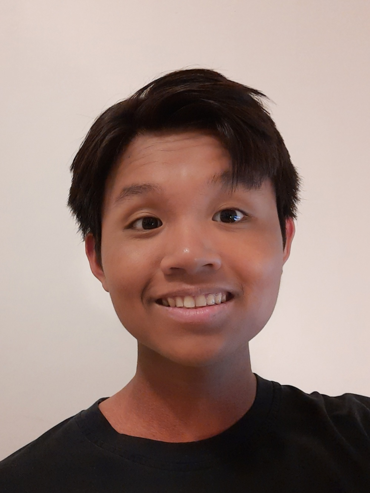
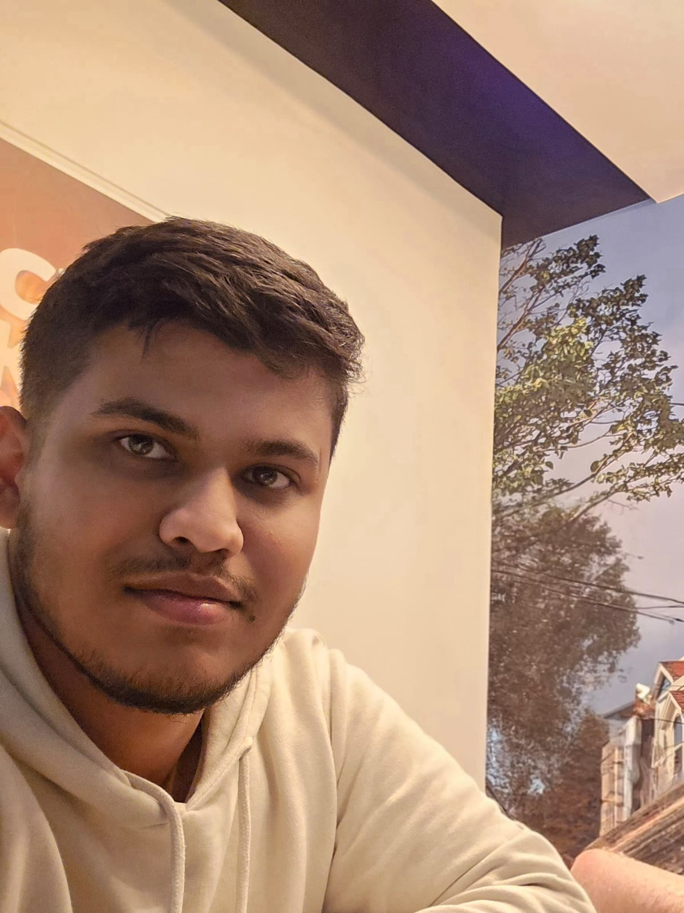

### Welcome to our group project 😎
$$Section: 311$$

---

$$Introduction$$
-
```diff
git checkout -b 'CST8152_310 Compilers'
git add 'Assignments'
git commit -m 'Programming Language'
git push -u origin 'CoreX'
```
---
$$About \ \ us$$
---

| <code></code>  | <code></code> | 
| - | - | 
| <b>Yen Huynh</b> </br> 041 068 712 </br> huyn0115@algonquinlive.com | <b>Mohammed Muhsin Shaik</b> </br> 041 078 827 </br> moha0987@algonquinlive.com |

---
$$Language$$
-
